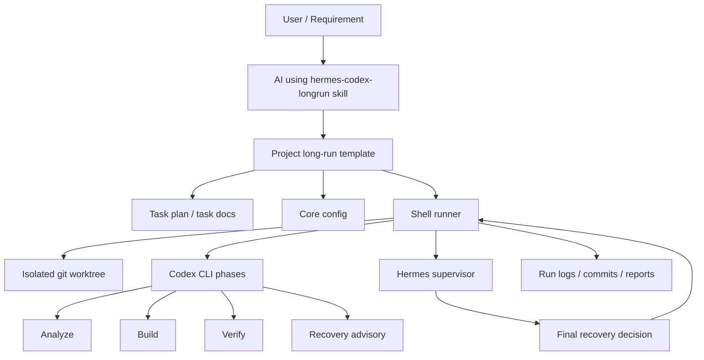
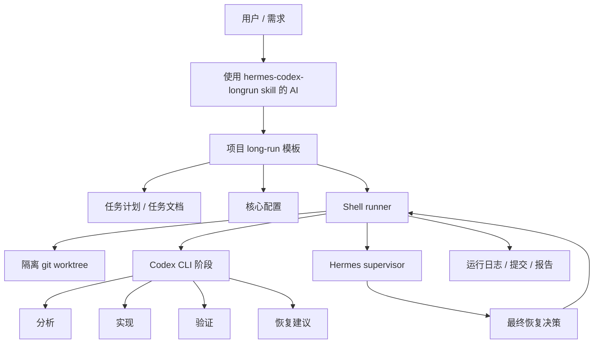

# Codex Orchestrator

Codex Orchestrator is a Codex skill for turning a large requirement into a supervised long-running implementation workflow.

It packages the `hermes-codex-longrun` skill:

- **Hermes** supervises the run and makes final recovery decisions.
- **Codex CLI** plans, implements, verifies, and writes recovery advisories.
- **Shell scripts** provide deterministic execution, timeouts, logs, worktrees, and commits.

## Why Use It

Large AI coding tasks often fail for predictable reasons: the requirement is too large for one turn, progress is hard to supervise, retries become ad hoc, and a failed subtask can derail the whole run. This skill turns that work into a planned, logged, recoverable pipeline.

Key advantages:

- Splits one large requirement into executable task slices.
- Keeps long runs supervised instead of relying on a single fragile prompt.
- Uses isolated git worktrees so the main checkout stays clean.
- Adds explicit recovery decisions when checks or verification fail.
- Preserves logs, reports, commits, and blocked-task records for review.

## Installation

Install the skill from GitHub:

```bash
python3 ~/.codex/skills/.system/skill-installer/scripts/install-skill-from-github.py \
  --repo Devil-MayCry/codex-orchestrator \
  --path skills/hermes-codex-longrun
```

Restart Codex after installation so the skill is discovered.

## Quick Start

After installing the skill, work with AI directly in your target project. Ask it to use this skill to split the requirement and prepare the long-run environment.

Example prompt:

```text
Use the hermes-codex-longrun skill. Read my requirement, split it into executable tasks, and prepare the long-run environment for this project.
```

The skill will scaffold the project template, turn the requirement into a task plan, prepare runtime configuration, and guide Hermes/Codex through the long-running workflow.

## Skill Architecture



## Core Parameters

Configuration is optional. If needed, override values in `ops/hermes-longrun/config.env` after the skill prepares the template.

```bash
CODEX_MODEL=gpt-5.5
CODEX_PHASE_TIMEOUT_SECONDS=1800
MAX_FIX_ATTEMPTS=2
HERMES_DECISION_TIMEOUT_SECONDS=300
PROJECT_PREFLIGHT_COMMANDS="npm test"
```

| Parameter | Default | Purpose |
| --- | --- | --- |
| `CODEX_MODEL` | `gpt-5.5` | Model used by Codex CLI. |
| `CODEX_PHASE_TIMEOUT_SECONDS` | `1800` | Wall-clock timeout for each Codex phase. |
| `MAX_FIX_ATTEMPTS` | `2` | Retry budget for build/fix attempts. |
| `HERMES_DECISION_TIMEOUT_SECONDS` | `300` | How long the runner waits for Hermes before accepting the advisory fallback. |
| `PROJECT_PREFLIGHT_COMMANDS` | empty | Project-specific setup/check commands before the run starts. |

## Repository Layout

```text
.
├── README.md
├── LICENSE
├── skills/
│   └── hermes-codex-longrun/
│       ├── SKILL.md
│       ├── scripts/
│       ├── references/
│       └── assets/hermes-longrun-template/
└── tests/
```

## 中文说明

Codex Orchestrator 是一个 Codex skill，用于把一份较大的需求拆成可监督、可恢复、可长期运行的实现流程。

它打包了 `hermes-codex-longrun` skill：

- **Hermes** 负责监督流程，并对恢复动作做最终决策。
- **Codex CLI** 负责规划、实现、验证，并输出恢复建议。
- **Shell 脚本** 负责确定性的执行、超时、日志、worktree 和提交。

## 为什么用它

大型 AI 编码任务常见的问题很明确：需求太大，单轮 prompt 难以完成；执行过程不容易监督；失败后的重试容易变成临时操作；一个子任务失败可能拖垮整个任务。这个 skill 把这些工作变成可规划、可记录、可恢复的流水线。

核心优点：

- 把一份大需求拆成可执行的任务切片。
- 长任务有监督流程，不依赖一次性 prompt 硬跑到底。
- 使用隔离 git worktree，避免污染主工作区。
- 检查或验证失败时进入明确的恢复决策流程。
- 保留日志、报告、提交和 blocked task 记录，方便复盘和审查。

## 中文安装

从 GitHub 安装 skill：

```bash
python3 ~/.codex/skills/.system/skill-installer/scripts/install-skill-from-github.py \
  --repo Devil-MayCry/codex-orchestrator \
  --path skills/hermes-codex-longrun
```

安装后重启 Codex，让 skill 被重新发现。

## 中文快速开始

安装 skill 后，直接在目标项目里让 AI 使用这个 skill 拆解需求并准备环境。

示例提示词：

```text
使用 hermes-codex-longrun skill。读取我的需求，把它拆成可执行任务，并为这个项目准备 long-run 环境。
```

skill 会生成项目模板，把需求拆成任务计划，准备运行配置，并引导 Hermes/Codex 进入长任务执行流程。

## Skill 架构图



## 核心参数

配置是可选的。需要调整时，在 skill 准备模板后修改 `ops/hermes-longrun/config.env`。

```bash
CODEX_MODEL=gpt-5.5
CODEX_PHASE_TIMEOUT_SECONDS=1800
MAX_FIX_ATTEMPTS=2
HERMES_DECISION_TIMEOUT_SECONDS=300
PROJECT_PREFLIGHT_COMMANDS="npm test"
```

| 参数 | 默认值 | 用途 |
| --- | --- | --- |
| `CODEX_MODEL` | `gpt-5.5` | Codex CLI 使用的模型。 |
| `CODEX_PHASE_TIMEOUT_SECONDS` | `1800` | 单个 Codex 阶段的超时时间。 |
| `MAX_FIX_ATTEMPTS` | `2` | 构建/修复重试预算。 |
| `HERMES_DECISION_TIMEOUT_SECONDS` | `300` | runner 等待 Hermes 决策的时间；超时后接受 advisory fallback。 |
| `PROJECT_PREFLIGHT_COMMANDS` | 空 | 运行前执行的项目级准备或检查命令。 |

## License

MIT
