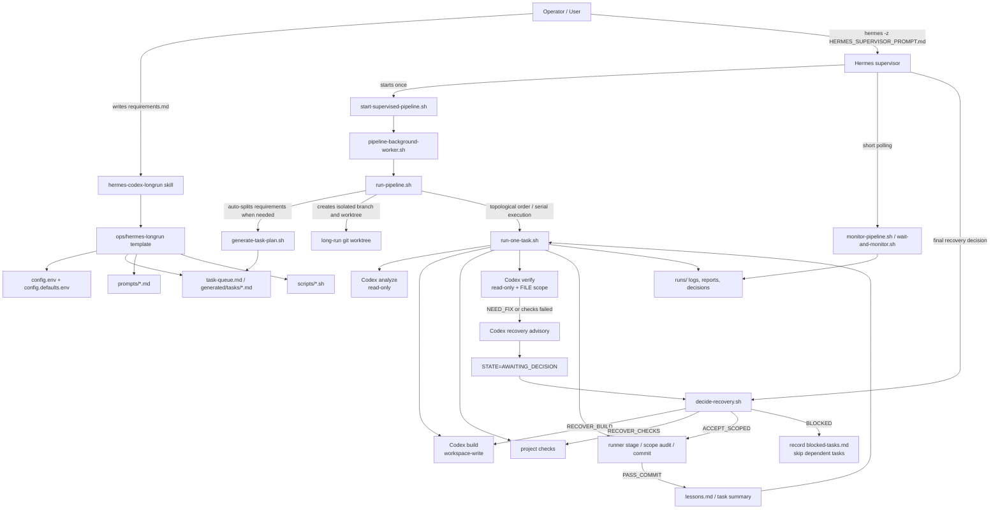
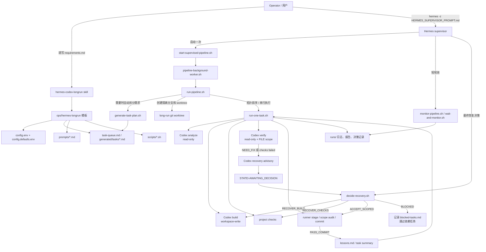

# Codex Orchestrator

Codex Orchestrator is a Codex skill for turning one large requirements document into a supervised long-running implementation pipeline:

- **Hermes** supervises the run, monitors state, and makes final recovery decisions.
- **Codex CLI** generates task slices, then performs analysis, implementation, verification, and recovery advisory work through `codex exec`.
- **Shell scripts** own deterministic control flow: preflight, background execution, state files, timeouts, recovery gates, git staging, commits, and blocked-task records.

This repository packages the installable skill as `skills/hermes-codex-longrun` while keeping GitHub-facing documentation at the repository root.

## What It Does

Codex Orchestrator is the `plus` variant of the Hermes + Codex long-run workflow. Codex writes `ADVISE_*` recovery advisories, but Hermes is the supervisor of record and writes the final decision through `decide-recovery.sh`.

Key behavior:

- Automatic task-plan generation from `ops/hermes-longrun/requirements.md`.
- Serial execution with topological task ordering from generated or manually supplied `task-queue.md`.
- Dependency-cascade skipping for downstream tasks after an explicit block.
- Per-phase Codex wall-clock timeouts.
- Verifier file-scope cross-checks before commit.
- Isolated git worktrees and branches for each run.
- `lessons.md` transfer across tasks.
- Recovery decisions of `RECOVER_BUILD`, `RECOVER_CHECKS`, `ACCEPT_SCOPED`, or `BLOCKED`.
- A default 300 second Hermes decision timeout that auto-approves the Codex advisory and records `auto_approved_by_timeout=1`.

## Installation

Install from GitHub with the Codex skill installer:

```bash
python3 ~/.codex/skills/.system/skill-installer/scripts/install-skill-from-github.py \
  --repo Devil-MayCry/codex-orchestrator \
  --path skills/hermes-codex-longrun
```

Restart Codex after installing so the skill is discovered.

For local development from a checked-out copy:

```bash
rsync -a --delete \
  skills/hermes-codex-longrun/ \
  "${CODEX_HOME:-$HOME/.codex}/skills/hermes-codex-longrun/"
```

Restart Codex after syncing local changes.

## Quick Start

Scaffold the long-run template into a target project:

```bash
python3 ~/.codex/skills/hermes-codex-longrun/scripts/init_longrun_template.py \
  --repo /path/to/project \
  --target ops/hermes-longrun
```

In the target project, replace the generated requirements placeholder:

```bash
$EDITOR ops/hermes-longrun/requirements.md
```

Then start Hermes:

```bash
hermes -z "$(cat ops/hermes-longrun/HERMES_SUPERVISOR_PROMPT.md)"
```

The startup command creates the long-run worktree and branch. If `task-queue.md` still contains the placeholder, Codex generates `generated/plan.md`, `generated/tasks/*.md`, and a real `task-queue.md`, then commits those planning artifacts before preflight and execution.

For local overrides, copy `config.env.example` to `config.env`. `config.env` is ignored by the template and is copied into the long-run worktree at startup.

Advanced users may replace `task-queue.md` and provide task docs manually. If the queue already validates, requirements-based auto-planning is skipped.

If you scaffolded into another directory, replace `ops/hermes-longrun` with that path.

## Monitoring And Recovery

Hermes should monitor the background pipeline with:

```bash
bash ops/hermes-longrun/scripts/monitor-pipeline.sh
```

If the monitor reports `STATE=RUNNING`, Hermes must keep supervising and run the bounded wait-and-monitor command until the pipeline reaches a terminal state or needs a decision:

```bash
bash ops/hermes-longrun/scripts/wait-and-monitor.sh
```

If it reports `STATE=AWAITING_DECISION`, read the advisory, verifier report, and checks log, then record the final decision with one of the copy-paste commands printed by the monitor. Valid actions are:

- `RECOVER_BUILD`
- `RECOVER_CHECKS`
- `ACCEPT_SCOPED`
- `BLOCKED`

Only `STATE=FINISHED`, `STATE=FAILED`, `STATE=ORPHANED`, or `STATE=NO_RUN` should be treated as terminal. The background runner may continue if Hermes exits, but that is a fallback, not the intended supervision flow.

The runner records decisions under `runs/<run-id>/recovery-decisions.md`. Blocked tasks are recorded under `runs/<run-id>/blocked-tasks.md`.

## Skill Architecture



The core layering is: the Codex skill installs the reusable template into a project; Hermes supervises and makes final recovery decisions; the shell runner owns deterministic state, timeouts, recovery gates, Git worktrees, and commits; Codex CLI only performs analysis, build, verification, and recovery advisory phases when invoked by the runner.

## Configurable Parameters

Configuration lives in the generated `ops/hermes-longrun/` directory. Copy `config.env.example` to `config.env` and override only the values you need; defaults live in `config.defaults.env`. Runtime precedence is: existing process environment > `config.env` > `config.defaults.env`.

Common override example:

```bash
cat > ops/hermes-longrun/config.env <<'EOF'
CODEX_MODEL=gpt-5.5
CODEX_PHASE_TIMEOUT_SECONDS=2400
MAX_FIX_ATTEMPTS=3
HERMES_DECISION_TIMEOUT_SECONDS=600
PROJECT_PREFLIGHT_COMMANDS="npm ci &&& npm test -- --runInBand"
COMMIT_SCOPE_ALLOW_PATTERNS="docs/ tests/ CHANGELOG.md package-lock.json"
EOF
```

| Parameter | Default | Description |
| --- | --- | --- |
| `CODEX_MODEL` | `gpt-5.5` | Model used for Codex CLI calls. |
| `CODEX_ANALYZE_EFFORT` | `xhigh` | Reasoning effort for `analyze`, planning, and escalation phases. |
| `CODEX_BUILD_EFFORT` | `high` | Reasoning effort for the `build` phase. |
| `CODEX_VERIFY_EFFORT` | `high` | Reasoning effort for the `verify` phase. |
| `CODEX_TRANSPORT_RETRIES` | `2` | Transport-level retry count for Codex CLI calls. |
| `CODEX_HEARTBEAT_SECONDS` | `60` | Heartbeat interval for long Codex phases. |
| `CODEX_PHASE_TIMEOUT_SECONDS` | `1800` | Wall-clock timeout, in seconds, for one Codex phase; timed-out phases are terminated and fed into recovery. |
| `MAX_FIX_ATTEMPTS` | `2` | Build recovery retry budget; total build attempts are roughly `MAX_FIX_ATTEMPTS + 1`. |
| `MAX_TASKS_PER_RUN` | `0` | Maximum tasks to execute in one run; `0` means unlimited. |
| `RECOVERY_DECISION_ENGINE` | `hermes` | Recovery decision engine; the plus variant should keep this as `hermes` because Codex only writes advisories. |
| `CONTINUE_ON_BLOCKED` | `1` | Whether to continue independent tasks after a task is marked `BLOCKED`. |
| `SKIP_DEPENDENTS_ON_BLOCKED` | `1` | Whether to cascade-skip downstream tasks that depend on a blocked task. |
| `ALLOW_SCOPED_ACCEPT` | `1` | Whether Hermes may choose `ACCEPT_SCOPED`. |
| `AUTO_PLAN_FROM_REQUIREMENTS` | `1` | Whether to generate the task plan from `requirements.md` when `task-queue.md` is still a placeholder. |
| `REQUIREMENTS_DOC` | `ops/hermes-longrun/requirements.md` | Requirements document used by auto-planning; it must be inside the repository. |
| `AUTO_PLAN_ARTIFACT_DIR` | `ops/hermes-longrun/generated` | Auto-planning output directory for `plan.md` and `generated/tasks/*.md`. |
| `AUTO_PLAN_DEFAULT_CHECKS` | `git diff --check` | Default check command written into generated tasks. |
| `AUTO_SETUP_KANBAN` | `1` | Whether to set up Hermes kanban after auto-planning. |
| `AUTO_PLAN_DRY_RUN` | `0` | Auto-planning test mode; `1` produces a deterministic single-task plan. |
| `HERMES_DECISION_TIMEOUT_SECONDS` | `300` | Seconds to wait in `AWAITING_DECISION`; timeout auto-approves the Codex advisory. |
| `HERMES_DECISION_POLL_SECONDS` | `5` | Poll interval, in seconds, for Hermes decision files. |
| `COMMIT_SCOPE_ALLOW_PATTERNS` | `docs/ CHANGELOG CHANGELOG.md tests/ task-queue.md` | Paths allowed in commits even when not declared by verifier `FILE:` lines; other paths downgrade `PASS_COMMIT` to `NEED_FIX`. |
| `WORKTREE_BRANCH_PREFIX` | `codex/longrun` | Branch prefix for long-run branches; a timestamp is appended. |
| `WORKTREE_PARENT` | empty | Parent directory for the generated worktree; empty means the target repository's parent directory. |
| `WORKTREE_PREFIX` | `longrun` | Directory name prefix for generated worktrees. |
| `RUNS_DIR` | `ops/hermes-longrun/runs` | Directory for logs, state, reports, and decision records. |
| `HERMES_BOARD` | `project-longrun` | Hermes kanban board name. |
| `USE_HERMES_KANBAN` | `1` | Whether to enable Hermes kanban state tracking. |
| `REQUIRED_COMMANDS` | empty | Extra commands required by preflight, separated by spaces, for example `uv docker`. |
| `PROJECT_PREFLIGHT_COMMANDS` | empty | Project-specific preflight commands; separate multiple commands with ` &&& `. |
| `RUN_PREFLIGHT` | `1` | Whether to run preflight before the pipeline starts. |
| `RUN_FULL_TESTS` | `0` | Whether recovery decision validation should consider the configured full-test command. |
| `ALLOW_DIRTY_WORKTREE` | `0` | Whether to allow task execution in an already dirty worktree; disabled by default to protect user edits. |
| `RECOVER_INTERRUPTED_WORKTREE` | `1` | Whether supervisor restart should try to preserve and recover interrupted worktree patches. |
| `SUPERVISOR_DETACH_METHOD` | `screen` | Background supervisor detach method; the template currently prefers `screen`. |
| `MONITOR_TAIL_LINES` | `80` | Number of log tail lines shown by the monitor. |
| `MONITOR_WAIT_SECONDS` | `60` | Seconds `wait-and-monitor.sh` waits before running one monitor pass. |
| `SKIP_CODEX_SMOKE` | `0` | Whether preflight skips the Codex CLI smoke test. |
| `SKIP_HERMES_SMOKE` | `0` | Whether preflight skips the Hermes smoke test. |
| `DRY_RUN` | `0` | Runner test mode; skips real Codex builds and commits. |
| `DRY_RUN_BLOCK_TASKS` | empty | Tasks to simulate as blocked during dry runs. |
| `DRY_RUN_CHECK_FAILURE_KIND` | empty | Simulated check failure kind during dry runs. |
| `DRY_RUN_CHECK_FAILURE_ONCE` | `0` | Whether dry-run check failure should happen only once. |
| `DRY_RUN_CHECK_FAILURE_ATTEMPTS` | empty | Specific attempts that should simulate check failure during dry runs. |
| `DRY_RUN_RECOVERY_ACTION` | `BLOCKED` | Default dry-run recovery action. |
| `DRY_RUN_RECOVERY_ACTIONS` | empty | Per-attempt dry-run recovery action sequence. |
| `DRY_RUN_VERIFY_VERDICT` | `PASS_COMMIT` | Default dry-run verifier verdict. |
| `DRY_RUN_VERIFY_VERDICTS` | empty | Per-attempt dry-run verifier verdict sequence. |
| `DRY_RUN_DECIDE_AS_ADVISORY` | `1` | Whether dry runs simulate decisions as accepting the advisory. |

A few advanced environment variables are usually set inline before startup rather than saved in `config.env`: `RUN_ID` fixes the run id, `RUN_DIR` fixes the run directory, `BRANCH` fixes the long-run branch name, `WORKTREE_DIR` fixes the worktree path, `TASK_SEQUENCE` overrides task order, `FULL_TEST_COMMAND` declares the full-test command, and `HERMES_DECIDED_BY` overrides the recorded decision maker.

## Repository Layout

```text
.
├── README.md
├── LICENSE
├── skills/
│   └── hermes-codex-longrun/
│       ├── SKILL.md
│       ├── agents/openai.yaml
│       ├── scripts/
│       ├── references/
│       └── assets/hermes-longrun-template/
├── tests/
└── .gitignore
```

## 中文说明

Codex Orchestrator 是一个用于长时间无人值守软件任务的 Codex skill。它把职责拆开：

- **Hermes** 负责监督流程、轮询状态、总结日志，并对每次恢复动作做最终决策。
- **Codex CLI** 通过 `codex exec` 负责分析、实现、验证和恢复建议。
- **Shell 脚本** 负责确定性的控制流，包括 preflight、后台执行、状态文件、超时、恢复闸门、Git 暂存、提交和 blocked task 记录。

这是 Hermes + Codex long-run 工作流的 `plus` 版本：Codex 只写 `ADVISE_*` 恢复建议，Hermes 通过 `decide-recovery.sh` 写入最终决策。默认情况下，如果 Hermes 在 300 秒内没有写入决策，runner 会自动批准 Codex 的建议，并记录 `auto_approved_by_timeout=1`。

## 中文安装

从 GitHub 安装：

```bash
python3 ~/.codex/skills/.system/skill-installer/scripts/install-skill-from-github.py \
  --repo Devil-MayCry/codex-orchestrator \
  --path skills/hermes-codex-longrun
```

安装后重启 Codex。

本地开发时，可以把仓库里的 skill 同步到 Codex skills 目录：

```bash
rsync -a --delete \
  skills/hermes-codex-longrun/ \
  "${CODEX_HOME:-$HOME/.codex}/skills/hermes-codex-longrun/"
```

同步后重启 Codex。

## 中文快速开始

在目标项目中生成长任务模板：

```bash
python3 ~/.codex/skills/hermes-codex-longrun/scripts/init_longrun_template.py \
  --repo /path/to/project \
  --target ops/hermes-longrun
```

然后只需要把 `requirements.md` 替换成你的大需求文档，再用生成的 `HERMES_SUPERVISOR_PROMPT.md` 启动 Hermes：

```bash
$EDITOR ops/hermes-longrun/requirements.md
hermes -z "$(cat ops/hermes-longrun/HERMES_SUPERVISOR_PROMPT.md)"
```

启动脚本会创建 long-run worktree/branch。如果 `task-queue.md` 仍是占位内容，它会先从 `requirements.md` 自动生成 `generated/plan.md`、`generated/tasks/*.md` 和真实 `task-queue.md`，并把这些规划产物提交到 long-run 分支，然后自动运行 preflight、kanban setup 和任务执行流程。

如果你已经手工写好了 `task-queue.md` 和任务文档，且校验通过，自动拆分会跳过，继续使用现有手工队列。

运行期间先用 `monitor-pipeline.sh` 观察状态；如果是 `STATE=RUNNING`，Hermes 必须继续监督，用有界等待命令继续轮询，直到进入终态或需要决策：

```bash
bash ops/hermes-longrun/scripts/wait-and-monitor.sh
```

当进入 `STATE=AWAITING_DECISION` 时，读取 advisory、verifier report 和 checks log，再使用 monitor 输出的 `decide-recovery.sh` 示例命令写入 `RECOVER_BUILD`、`RECOVER_CHECKS`、`ACCEPT_SCOPED` 或 `BLOCKED`。只有 `STATE=FINISHED`、`STATE=FAILED`、`STATE=ORPHANED` 或 `STATE=NO_RUN` 才算终态；后台 runner 可能在 Hermes 退出后继续跑完，但这只是容错，不是推荐监督流程。

## Skill 架构图



核心分层是：Codex skill 负责把可复用模板安装到项目；Hermes 负责监督和最终决策；Shell runner 负责确定性状态机、超时、恢复闸门、Git worktree 和提交；Codex CLI 只在被 runner 调用时执行分析、构建、验证和恢复建议。

## 可配置参数

配置文件位于生成后的 `ops/hermes-longrun/` 下。推荐复制 `config.env.example` 为 `config.env`，只写需要覆盖的项；默认值保存在 `config.defaults.env`。运行时优先级是：启动进程已有环境变量 > `config.env` > `config.defaults.env`。

常用覆盖示例：

```bash
cat > ops/hermes-longrun/config.env <<'EOF'
CODEX_MODEL=gpt-5.5
CODEX_PHASE_TIMEOUT_SECONDS=2400
MAX_FIX_ATTEMPTS=3
HERMES_DECISION_TIMEOUT_SECONDS=600
PROJECT_PREFLIGHT_COMMANDS="npm ci &&& npm test -- --runInBand"
COMMIT_SCOPE_ALLOW_PATTERNS="docs/ tests/ CHANGELOG.md package-lock.json"
EOF
```

| 参数 | 默认值 | 说明 |
| --- | --- | --- |
| `CODEX_MODEL` | `gpt-5.5` | Codex CLI 调用使用的模型。 |
| `CODEX_ANALYZE_EFFORT` | `xhigh` | `analyze`、规划和升级分析阶段的推理强度。 |
| `CODEX_BUILD_EFFORT` | `high` | `build` 阶段的推理强度。 |
| `CODEX_VERIFY_EFFORT` | `high` | `verify` 阶段的推理强度。 |
| `CODEX_TRANSPORT_RETRIES` | `2` | Codex CLI 调用失败时的传输层重试次数。 |
| `CODEX_HEARTBEAT_SECONDS` | `60` | 长时间 Codex 阶段的心跳间隔。 |
| `CODEX_PHASE_TIMEOUT_SECONDS` | `1800` | 单个 Codex 阶段的墙钟超时秒数；超时后 runner 会终止该阶段并进入恢复建议。 |
| `MAX_FIX_ATTEMPTS` | `2` | 构建修复重试预算；总构建尝试数约为 `MAX_FIX_ATTEMPTS + 1`。 |
| `MAX_TASKS_PER_RUN` | `0` | 单次 run 最多执行多少个任务；`0` 表示不限制。 |
| `RECOVERY_DECISION_ENGINE` | `hermes` | 恢复决策引擎；plus 版本应保持为 `hermes`，Codex 只写 advisory。 |
| `CONTINUE_ON_BLOCKED` | `1` | 任务被标记 `BLOCKED` 后是否继续执行不依赖它的任务。 |
| `SKIP_DEPENDENTS_ON_BLOCKED` | `1` | 上游任务 blocked 后是否级联跳过依赖它的下游任务。 |
| `ALLOW_SCOPED_ACCEPT` | `1` | 是否允许 Hermes 选择 `ACCEPT_SCOPED` 进行范围内接受。 |
| `AUTO_PLAN_FROM_REQUIREMENTS` | `1` | 当 `task-queue.md` 仍是占位内容时，是否从 `requirements.md` 自动生成任务计划。 |
| `REQUIREMENTS_DOC` | `ops/hermes-longrun/requirements.md` | 自动规划读取的需求文档路径，必须在仓库内。 |
| `AUTO_PLAN_ARTIFACT_DIR` | `ops/hermes-longrun/generated` | 自动规划产物目录，包含 `plan.md` 和 `generated/tasks/*.md`。 |
| `AUTO_PLAN_DEFAULT_CHECKS` | `git diff --check` | 自动生成任务时写入每个任务的默认检查命令。 |
| `AUTO_SETUP_KANBAN` | `1` | 自动规划后是否设置 Hermes kanban。 |
| `AUTO_PLAN_DRY_RUN` | `0` | 自动规划的测试模式；设为 `1` 时生成确定性的单任务计划。 |
| `HERMES_DECISION_TIMEOUT_SECONDS` | `300` | `AWAITING_DECISION` 状态下等待 Hermes 决策的秒数；超时会自动批准 Codex advisory。 |
| `HERMES_DECISION_POLL_SECONDS` | `5` | runner 轮询 Hermes 决策文件的间隔秒数。 |
| `COMMIT_SCOPE_ALLOW_PATTERNS` | `docs/ CHANGELOG CHANGELOG.md tests/ task-queue.md` | verifier 未声明但允许进入提交范围的路径模式；超出范围会把 `PASS_COMMIT` 降级为 `NEED_FIX`。 |
| `WORKTREE_BRANCH_PREFIX` | `codex/longrun` | long-run 分支名前缀，实际分支会追加时间戳。 |
| `WORKTREE_PARENT` | 空 | worktree 父目录；为空时使用目标仓库父目录。 |
| `WORKTREE_PREFIX` | `longrun` | worktree 目录名前缀。 |
| `RUNS_DIR` | `ops/hermes-longrun/runs` | 运行日志、状态、报告和决策记录目录。 |
| `HERMES_BOARD` | `project-longrun` | Hermes kanban board 名称。 |
| `USE_HERMES_KANBAN` | `1` | 是否启用 Hermes kanban 状态追踪。 |
| `REQUIRED_COMMANDS` | 空 | preflight 额外要求存在的命令，空格分隔，例如 `uv docker`。 |
| `PROJECT_PREFLIGHT_COMMANDS` | 空 | 项目自定义 preflight 命令；多条命令用 ` &&& ` 分隔。 |
| `RUN_PREFLIGHT` | `1` | 是否在 pipeline 开始时运行 preflight。 |
| `RUN_FULL_TESTS` | `0` | 是否在恢复决策校验中考虑全量测试命令。 |
| `ALLOW_DIRTY_WORKTREE` | `0` | 是否允许在已有脏 worktree 上运行任务；默认禁止以保护用户改动。 |
| `RECOVER_INTERRUPTED_WORKTREE` | `1` | 重新启动 supervisor 时是否尝试保护和恢复被中断的 worktree。 |
| `SUPERVISOR_DETACH_METHOD` | `screen` | supervisor 后台运行方式；当前模板优先使用 `screen`。 |
| `MONITOR_TAIL_LINES` | `80` | monitor 输出日志尾部的行数。 |
| `MONITOR_WAIT_SECONDS` | `60` | `wait-and-monitor.sh` 每次等待后再 monitor 的秒数。 |
| `SKIP_CODEX_SMOKE` | `0` | preflight 时是否跳过 Codex CLI smoke test。 |
| `SKIP_HERMES_SMOKE` | `0` | preflight 时是否跳过 Hermes smoke test。 |
| `DRY_RUN` | `0` | runner 测试模式，不执行真实 Codex 构建和提交。 |
| `DRY_RUN_BLOCK_TASKS` | 空 | dry-run 中直接模拟 blocked 的任务列表。 |
| `DRY_RUN_CHECK_FAILURE_KIND` | 空 | dry-run 中模拟检查失败的类型。 |
| `DRY_RUN_CHECK_FAILURE_ONCE` | `0` | dry-run 中是否只模拟一次检查失败。 |
| `DRY_RUN_CHECK_FAILURE_ATTEMPTS` | 空 | dry-run 中指定哪些尝试触发检查失败。 |
| `DRY_RUN_RECOVERY_ACTION` | `BLOCKED` | dry-run 默认恢复动作。 |
| `DRY_RUN_RECOVERY_ACTIONS` | 空 | dry-run 按尝试序列指定恢复动作。 |
| `DRY_RUN_VERIFY_VERDICT` | `PASS_COMMIT` | dry-run 默认 verifier 结论。 |
| `DRY_RUN_VERIFY_VERDICTS` | 空 | dry-run 按尝试序列指定 verifier 结论。 |
| `DRY_RUN_DECIDE_AS_ADVISORY` | `1` | dry-run 中是否把恢复决策模拟为接受 advisory。 |

还有少量高级环境变量通常不写入 `config.env`，但可在启动命令前临时指定：`RUN_ID` 固定本次运行 ID，`RUN_DIR` 固定运行目录，`BRANCH` 固定 long-run 分支名，`WORKTREE_DIR` 固定 worktree 路径，`TASK_SEQUENCE` 覆盖任务执行顺序，`FULL_TEST_COMMAND` 声明全量测试命令，`HERMES_DECIDED_BY` 覆盖恢复决策记录中的决策人。

## License

MIT
